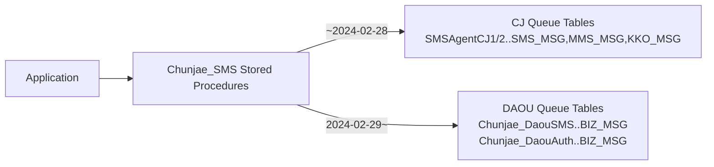

# 서비스 벤더 변환 작업 (CJ 올리브네트웍스 → 다우 비즈뿌리오)

## 1. 작업 개요

운영 중인 문자/카카오 메시징 서비스에서 **기존 벤더(CJ 올리브네트웍스)**를 **다우 비즈뿌리오**로 전환하면서, 애플리케이션의 호출 인터페이스(Stored Procedure)는 유지한 채 **DB 적재 대상(Queue Table) 및 벤더 규격**을 다우 기준으로 맞추도록 SQL을 개선한 작업이다.

* **목표**

  * 서비스 연동 코드를 크게 바꾸지 않고 벤더 전환(컷오버) 수행
  * 다우 메시지 규격(BIZ_MSG) 기반으로 SMS/MMS/알림톡(AT) 발송 적재 구조 전환
  * 다우 결과코드 표준화(운영/장애 대응을 위한 매핑 테이블 구축)
  * 다우 요구 식별자(CMID) 생성을 위한 **SEQUENCE 기반 ID 발급 체계 구축**

* **컷오버 기준일**

  * 프로시저 내 분기 기준: **`2024-02-29`**
  * `@STDTime < '2024-02-29'` → 기존 CJ 테이블 적재
  * `@STDTime >= '2024-02-29'` → 다우 BIZ_MSG 적재

---

## 2. 기존 구조 vs 변경 구조

### 2.1 기존(CJ) 구조

애플리케이션 → `Chunjae_SMS` 프로시저 호출 → CJ 벤더 큐 테이블에 INSERT

* SMS: `SMSAgentCJ1.dbo.SMS_MSG`
* MMS: `SMSAgentCJ1.dbo.MMS_MSG`
* 일부 채널/업무: `SMSAgentCJ2.dbo.SMS_MSG`, `SMSAgentCJ2.dbo.KKO_MSG`

### 2.2 변경(다우) 구조

애플리케이션 → `Chunjae_SMS` 프로시저 호출(동일) → 다우 벤더 큐 테이블에 INSERT

* SMS/MMS 중심: `Chunjae_DaouSMS.dbo.BIZ_MSG`
* 인증/알림톡 중심(업무 분리): `Chunjae_DaouAuth.dbo.BIZ_MSG`



---

## 3. 변경 범위 (DB 객체)

### 3.1 수정한 Stored Procedure

* `dbo.SMS_Send` : SMS 발송 적재
* `dbo.MMS_Send` : MMS 발송 적재
* `dbo.SMS5_Send` : 특정 업무/SMS(인증 계열로 분리) 적재
* `dbo.KKO_Send` : 알림톡(AT) 적재
* `dbo.KKO_Msg_Send` : 알림톡(AT) 적재(별도 경로)

### 3.2 신규 생성 객체 (다우 식별자/운영 지원)

* **SEQUENCE**

  * `DaouSeq` : 1 ~ 99,999,999 (CYCLE)
  * `DaouMESSeq` : 1 ~ 999,999,999 (CYCLE, 대량전송용 분리 목적)
* **유틸 프로시저**

  * `GenerateSMSSeqNumbers` : RowCount 만큼 CMID 샘플 생성(테스트/대량발급용)
* **결과코드 매핑 테이블**

  * `SMS_DaouResultCode (CODE, TYPE, MSG_TYPE, Desc)`
  * COMMON/SMS/MMS/KKO 등 결과코드 사전 등록

---

## 4. 핵심 구현 내용

### 4.1 컷오버 분기 처리 (CJ → 다우)

프로시저 내부에서 기준일(2024-02-29)을 기준으로 INSERT 대상 테이블을 분기했다.

* CJ 기간: 기존 큐 테이블 유지 (`SMSAgentCJ1/2...`)
* 다우 기간: 다우 큐 테이블로 적재 (`Chunjae_DaouSMS/Chunjae_DaouAuth..BIZ_MSG`)

### 4.2 CMID 생성 체계 구축 (SEQUENCE 기반)

다우 적재 시 요구되는 식별자 **CMID**를 `DaouSeq`로 발급해 생성했다.

* 생성 형식(예시): `YYYYMMDD + 8자리Seq + '-' + CID`
* 일부 유틸은 `'-M' + CID` 형태로 생성(대량/샘플 발급 목적)

예시 로직(개념):

```sql
SET @SeqNo = NEXT VALUE FOR DaouSeq;
SET @NewSeqNo = RIGHT('00000000' + CAST(@SeqNo AS VARCHAR), 8);
SET @CMID = CONVERT(VARCHAR(8), GETDATE(), 112) + @NewSeqNo + '-' + CONVERT(VARCHAR, @Cid);
```

### 4.3 채널별(MSG_TYPE) 매핑 및 컬럼 규격 반영

다우 `BIZ_MSG`에 채널/메시지 특성에 맞춰 `MSG_TYPE` 및 필수 컬럼을 반영했다.

* SMS: `MSG_TYPE = 0`
* MMS: `MSG_TYPE = 5`
* 알림톡(AT): `MSG_TYPE = 6`
* 공통:

  * `STATUS = 0` (대기/요청)
  * `NATION_CODE = '82'`
  * `DEST_PHONE`, `SEND_PHONE`, `REQUEST_TIME`, `SEND_TIME`, `MSG_BODY` 등 다우 규격 필드 매핑

---

## 5. 프로시저별 상세 변경 요약

### 5.1 `SMS_Send` (SMS 적재)

* **기존(CJ)**: `SMSAgentCJ1.dbo.SMS_MSG`
* **변경(다우)**: `Chunjae_DaouSMS.dbo.BIZ_MSG`
* 다우 적재 컬럼(주요):

  * `REQUEST_TIME`, `SEND_TIME`, `SERIALNUM`, `CMID`
  * `MSG_TYPE=0`, `DEST_PHONE`, `SEND_PHONE`, `MSG_BODY`
  * `ETC1~ETC6` 확장 적재(운영/추적용)

### 5.2 `MMS_Send` (MMS 적재)

* **기존(CJ)**: `SMSAgentCJ1.dbo.MMS_MSG`
* **변경(다우)**: `Chunjae_DaouSMS.dbo.BIZ_MSG`
* 다우 적재 컬럼(주요):

  * `MSG_TYPE=5`, `SUBJECT`, `MSG_BODY`
  * `NATION_CODE='82'`
* CJ의 `FILE_CNT` 등과 **스키마 차이**를 주석으로 명시하고 다우 규격에 맞춰 적재

### 5.3 `SMS5_Send` (특정 업무/SMS 적재)

* **기존(CJ)**: `SMSAgentCJ2.dbo.SMS_MSG`
* **변경(다우)**: `Chunjae_DaouAuth.dbo.BIZ_MSG`
* 특징:

  * 업무 특성상 `DaouAuth` DB로 분리(인증/업무성 발송 영역)

### 5.4 `KKO_Send` (알림톡 적재)

* **기존(CJ)**: `SMSAgentCJ2.dbo.KKO_MSG`
* **변경(다우)**: `Chunjae_DaouAuth.dbo.BIZ_MSG`
* 다우 적재 컬럼(주요):

  * `MSG_TYPE=6`, `SENDER_KEY`, `TEMPLATE_CODE`
  * 실패 대체 발송: `RE_TYPE`, `RE_BODY`
  * `ATTACHED_FILE` 반영 (템플릿 테이블에서 조회)

### 5.5 `KKO_Msg_Send` (알림톡 적재 - 별도 경로)

* **기존(CJ)**: `SMSAgentCJ2..KKO_MSG`
* **변경(다우)**: `Chunjae_DaouAuth..BIZ_MSG`
* 특징:

  * CJ는 `Values`, 다우는 `Values` 방식으로 명확히 적재 로직 분리
  * `ATTACHED_FILE`, `RE_TYPE`, `RE_BODY`, `NATION_CODE` 반영

---

## 6. 템플릿/키 변경 작업 (데이터 정합성)

알림톡 템플릿의 `Profile_key` 값이 벤더 전환으로 변경되어, 운영 DB의 `KKO_Template`에서 **Profile_key 매핑 업데이트**를 수행했다.

* 작업 내용: 특정 기존 Profile_key → 신규 Profile_key로 치환
* 작업 방식: `BEGIN TRAN`으로 작업 영향 확인 후 롤백/커밋 선택 가능하게 절차화(스크립트 기반)

> 이 작업은 “단순 값 변경”이 아니라, **벤더 변경 시 메시지 실패율/템플릿 불일치 장애를 예방**하는 운영 필수 조치다.

---

## 7. 결과코드 표준화 (운영 대응력 강화)

벤더 변경으로 인해 메시지 전송 결과코드가 달라지므로, 운영자가 실패 원인을 신속히 판단할 수 있도록 결과코드 매핑 테이블을 구축했다.

* 테이블: `SMS_DaouResultCode`
* 컬럼: `(CODE, TYPE, MSG_TYPE, Desc)`
* 내용: COMMON/SMS/MMS/KKO/RCS 등 다우 코드 사전 등록

**효과**

* 실패 코드 기반 재처리/차단/알람 룰 설계 기반 마련
* 운영 장애 대응 시 “벤더 코드 해석” 병목 제거

---

## 8. 검증 포인트 (운영 관점)

### 8.1 기능 검증 (채널별)

* SMS: 다우 `BIZ_MSG` 적재 후 발송 성공/실패 코드 확인
* MMS: `SUBJECT`, `MSG_BODY` 적재 및 수신 단말에서 표시 확인
* 알림톡(AT): `SENDER_KEY`, `TEMPLATE_CODE`, `ATTACHED_FILE` 정상 반영 확인
* 실패 대체 발송: `RE_TYPE`, `RE_BODY` 동작 여부 확인

### 8.2 운영 검증 (추적성)

* CMID 중복 없음(SEQ 기반)
* `ETC1~ETC6`에 추적용 값 적재(요청자/업무/메시지 식별)
* 컷오버 기준일 이후 CJ 테이블로 적재되지 않는지 확인

---

## 9. 성과 및 기여 

* **“벤더 전환(CJ → 다우) 과정에서 기존 서비스 호출 인터페이스(Stored Procedure API)는 유지하고, DB 적재 대상(Queue)만 분기 처리하여 컷오버를 지원.”**
* **“다우 요구 식별자(CMID) 체계 대응을 위해 SEQUENCE(DaouSeq) 기반 발급 로직을 설계/적용하여 메시지 추적성 및 중복 방지를 확보.”**
* **“다우 결과코드 매핑 테이블(SMS_DaouResultCode)을 구축하여 장애 분석 및 운영 대응 효율을 개선.”**
* **“알림톡 전환 시 Template/Key/첨부파일(ATTACHED_FILE) 등 채널별 스키마 차이를 반영하여 전환 이후 메시지 실패 리스크를 최소화.”**


## 10. 사용 기술/역량 태그

* **SQL Server** (Stored Procedure, SEQUENCE, 트랜잭션 스크립팅)
* **메시징 시스템 운영** (Queue 적재 방식 이해, 벤더 전환/컷오버)
* **데이터 정합성 관리** (템플릿/키 매핑, 규격 차이 반영)
* **운영 표준화** (결과코드 사전 구축, 추적성(CMID) 강화)

---
